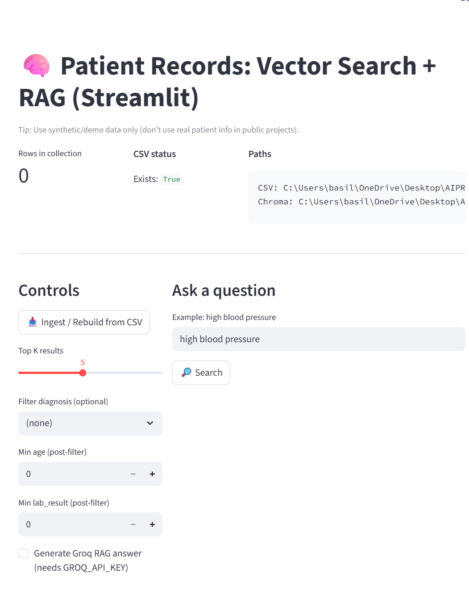
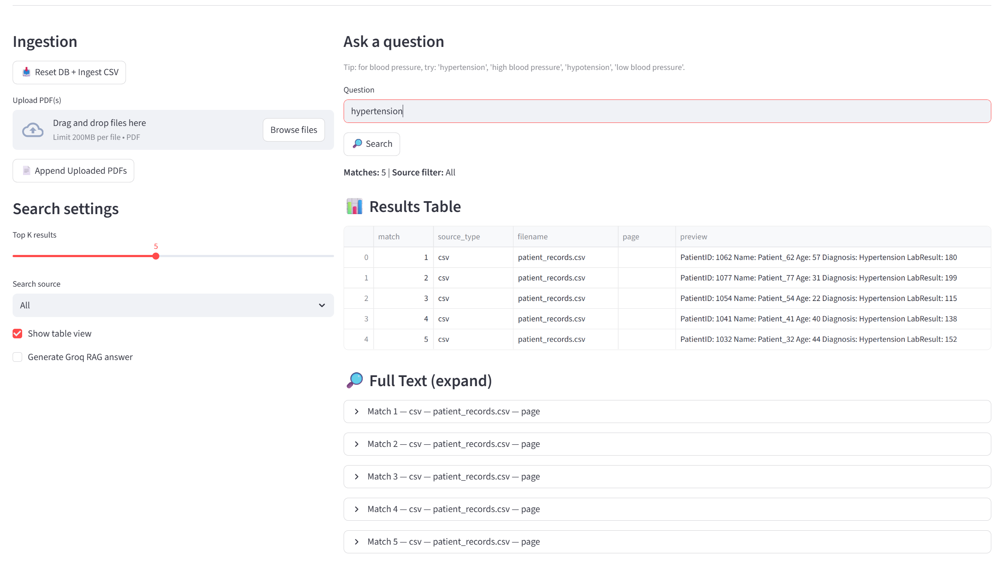
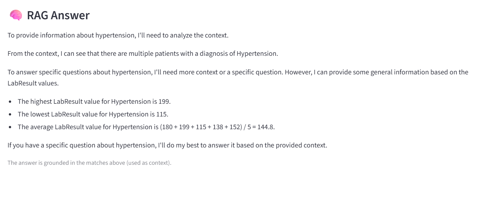

## 🚀 Live Demo
👉 https://vectorrag-ai.streamlit.app/

# 📄 Vector RAG App (Streamlit + ChromaDB)

An end-to-end **Retrieval-Augmented Generation (RAG)** application that lets users upload CSV and PDF documents, perform **semantic search** using vector embeddings, and optionally generate **grounded answers** with an LLM — all through an interactive **Streamlit** web UI.

> 🔎 Upload documents → 🧠 Embed + retrieve with ChromaDB → 💬 Ask questions → 📊 Explore results in a table → 🤖 (Optional) Generate RAG answers

---

## 🚀 Features

- 📥 **Ingest CSV & PDF files**
- ✂️ **Chunk long documents** for better retrieval
- 🧬 **SentenceTransformers embeddings**
- 🗃️ **ChromaDB vector store** (persistent local DB)
- 🔎 **Semantic search (Top-K retrieval)**
- 🏷️ **Metadata filtering** (CSV vs PDF, filename, page)
- 📊 **Results table view + full-text expanders**
- 🤖 **Optional RAG answers** using Groq LLM
- 🖥️ **Interactive Streamlit UI**

---

## 🧱 Tech Stack

- **Python**
- **Streamlit** (UI)
- **ChromaDB** (Vector Database)
- **SentenceTransformers** (Embeddings)
- **LangChain** (Loaders, text splitters)
- **Groq** (Optional LLM for generation)

---

## ▶️ Run Locally

```bash
# Create environment (optional but recommended)
python -m venv .venv
.venv\Scripts\activate   # Windows
# source .venv/bin/activate  # Mac/Linux

# Install dependencies
pip install -r requirements.txt

# Run the app
streamlit run app.py


http://localhost:8501

Project structure
ai-vector-project/
├─ app.py                # Streamlit app
├─ patient_records.csv  # Sample CSV dataset
├─ requirements.txt     # Python dependencies
├─ chroma_db/           # Vector store (ignored in git)
├─ uploads/             # Uploaded PDFs (ignored in git)
└─ README.md

## 📸 Screenshots

### Main App UI


### Search Results (Table View)


### RAG Answer (LLM-grounded)

